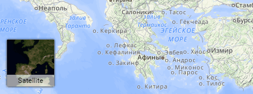

# Leaflet-IconLayers



Leaflet base layers switching control with icons ([example](https://scanex.github.com/Leaflet-IconLayers/examples))

*Requires Leaflet 0.7.3 or newer; IE9+*

Extends `L.Control`.

## Using Control

Copy files from `src` dir and include them to your project.

Basic usage:

```javascript
L.control.iconLayers(layers).addTo(map);
```

In order to interact with layers Leaflet-IconLayers uses an array of layer objects, that have following fields:
- `icon` - icon url (typically 80x80)
- `title` - a short string that is displayed at the bottom of each icon
- `layer` - any Leaflet `ILayer`

You can pass this array to construtor or use `setLayers` method.

The second constructor argument may be `options` hash. It is also ok if it is the only one.

## Options

- `maxLayersInRow` - the number of layers, that a row can contain
- `manageLayers` - by default control manages map layers. Pass `false` if you want to manage layers manually.

plus `L.Control` options (`position`)

## Methods

- `setLayers(<Array> layers)` - replace layers array with a new one
- `setActiveLayer(<ILayer> layer)` - set active layer
- `collapse()` - hide secondary layers
- `expand()` - show hidden layers

## Events

- `activelayerchange` - fires when user changes active layer (clicks one of layer icons). The changed layer is passed in `layer` key of an event object (see an example).

## Detailed example
```javascript
var iconLayersControl = new L.Control.IconLayers(
    [
        {
            title: 'Map', // use any string
            layer: mapLayer, // any ILayer
            icon: 'img/mapIcon.png' // 80x80 icon
        },
        {
            title: 'Satellite',
            layer: satLayer,
            icon: 'img/mapIcon.png'
        }
    ], {
        position: 'bottomleft',
        maxLayersInRow: 5
    }
);

// new L.Control.IconLayers(layers)
// new L.Control.IconLayers(options)
// are also ok

iconLayersControl.addTo(map);

// we can modify layers list
iconLayersControl.setLayers(layers);

iconLayersControl.on('activelayerchange', function(e) {
    console.log('layer switched', e.layer);
});
```